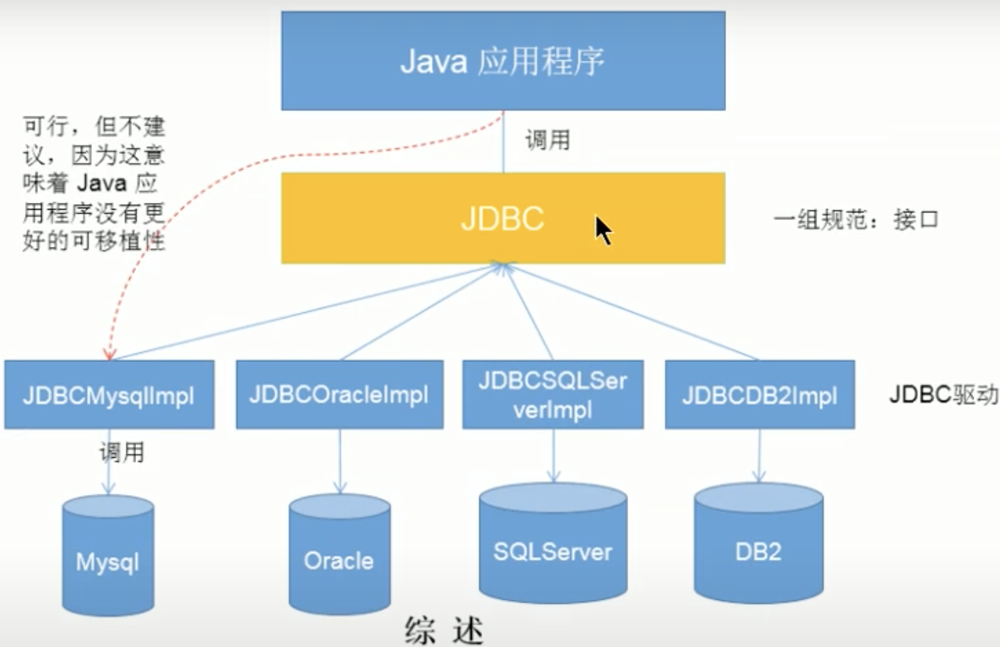
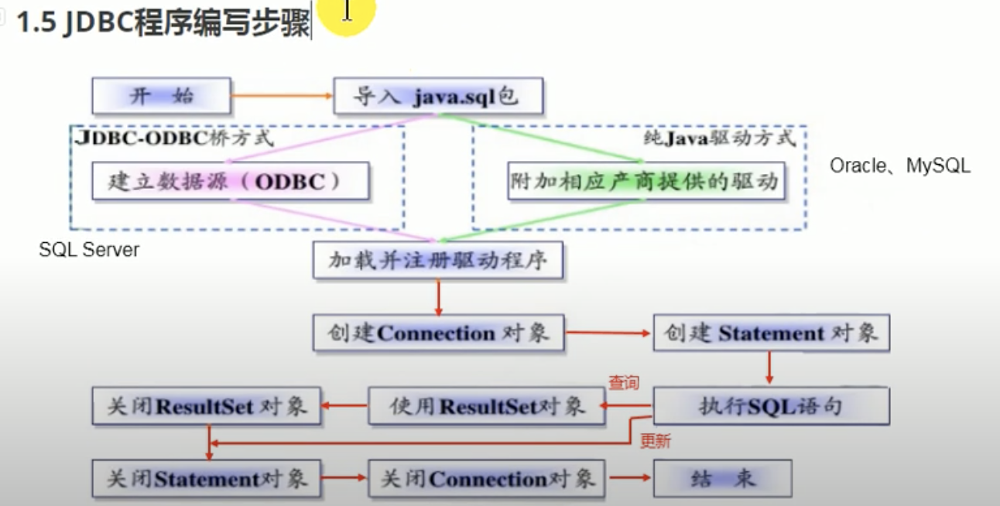

# JDBC

## 定义:
    JDBC 是sun公司提供的一套用于数据库操作的接口，Java程序员只需要面向这套接口编程即可。‘不同的数据库厂商，需要针对这套接口，提供不同实现，不同的实现的集合，即为不同数据库的驱动。 --- 面向接口编程

## JDBC 架构: 
    

    - 面向应用的API: Java API, 抽象接口，供应用程序开发人员使用 (连接数据库，执行SQL语句，获得结果集)
    - 面向数据库的API: Java Driver API, 供开发商开发数据库驱动程序使用

## JDBC Steps:

